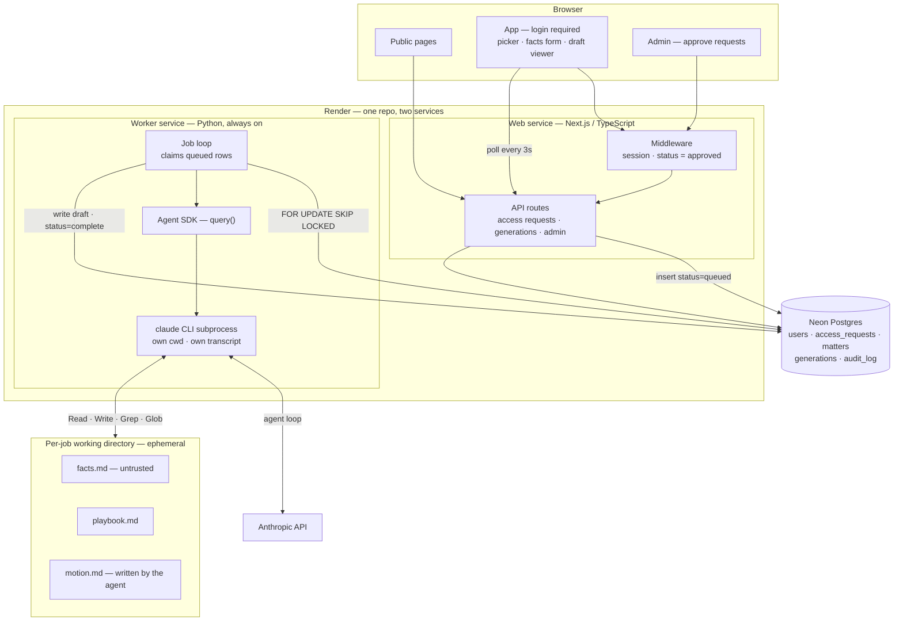

# Under Construction — System Architecture

**Date:** August 2026 · **Revision 2** — rewritten after settling on an agentic worker
**Companion docs:** `under-construction-v0-scope-and-backlog.md`, `under-construction-implementation-guide.md`

This document explains what we're building, where each piece lives, and — for every consequential choice — what the alternative was and why we didn't take it. The reasoning matters more than the picks; if a premise changes, the pick should change with it.

**What changed in revision 2.** The drafting step is genuinely agentic — the model decides what to look at next, re-reads the case facts, summarises, and chooses its own steps rather than following a fixed sequence. That means the Claude Agent SDK, and the Agent SDK spawns a `claude` CLI subprocess that owns a shell, a working directory, and session files on local disk. That single fact rules out serverless hosting and reshapes most of what follows.

---

## 1. The system at a glance



**The shape in one sentence:** one repository, two services running as containers on Render, one Postgres database that is also the only interface between the two services, and a Python worker that runs the Agent SDK against a scratch directory it creates and destroys per job.

---

## 2. How a draft actually gets made

1. Lawyer picks **cause of action** and **jurisdiction** from dropdowns fed by the playbook registry, enters the case facts, and hits Generate.
2. `POST /api/generations` validates, writes a `generations` row with `status = 'queued'`, and returns the id immediately.
3. The **Python worker**, which is always running, polls for queued rows and claims one with `SELECT … FOR UPDATE SKIP LOCKED`, setting `status = 'running'`. This is the only handoff between the two services, and it happens through the database.
4. The worker creates a **fresh working directory** for the job and writes two files into it: the composed playbook, and the case facts.
5. The worker calls the Agent SDK's `query()` with that directory as `cwd`, a minimal tool allowlist, and a `maxTurns` cap. The SDK spawns a `claude` subprocess.
6. **The agent loop runs.** Claude reads the playbook, reads the facts, re-reads what it needs, summarises, decides what to do next, and eventually writes the motion to `motion.md` in its working directory. This is the part that is genuinely non-deterministic and the reason we're using the SDK at all.
7. The worker reads `motion.md`, writes it to the `generations` row with the token counts, cost, latency and playbook version, sets `status = 'complete'`, and **deletes the working directory**.
8. The browser, polling `GET /api/generations/:id` every few seconds, sees `complete` and renders the draft with a copy button and the unverified-citations banner.
9. On failure — an error, or `maxTurns` exhausted without a `motion.md` — `status = 'failed'` with a plain-language message, the directory is deleted anyway, and the user gets a retry button.

---

## 3. The decisions

### 3.1 The Agent SDK, and what it costs to host

**Decision: the Claude Agent SDK, in Python, running in a persistent container.**

The alternative was a controlled chain of Messages API calls — draft, critique, revise — which is deterministic, trivially hostable, and much cheaper to operate. It was rejected on the requirement: the drafting step needs to decide for itself what to examine next, go back to the facts, and summarise as it goes. That is an agent, not a pipeline, and faking it with a fixed chain would mean guessing the sequence in advance.

**What the SDK actually is**, because this drives everything else. Per Anthropic's hosting documentation: calling `query()` spawns a separate `claude` CLI process that talks to your code over stdio and owns a shell, a working directory, and JSONL session transcripts on local disk. Their framing: *"Hosting it is not like hosting a stateless API wrapper. Every running agent is a long-lived process tied to local state."*

The concrete consequences:

| Property | Consequence for us |
|---|---|
| One session = one subprocess | Concurrency is bounded by RAM, not by connection limits |
| ~1 GiB RAM, 1 CPU, 5 GiB disk per agent (Anthropic's stated floor) | The worker needs real sizing; two concurrent drafts is a different instance from ten |
| State on local disk, lost on restart | Fine for us — each job is self-contained and we delete the directory anyway. A `SessionStore` adapter is only needed if we later want resumable sessions |
| No built-in session timeout | We must set `maxTurns`. Without it a stuck agent runs until something else kills it |
| Needs outbound HTTPS to `api.anthropic.com` | Trivial, but worth knowing if egress ever gets locked down |
| Available in Python *and* TypeScript | The SDK does not pick our language for us — §3.3 does |

**Cost becomes unpredictable, and that is the real operational change.** A single API call has a cost you can estimate in advance. An agent loop that decides to re-read the record four times can cost several times that, and the variance is the point of using it. `maxTurns`, a per-generation cost record, and a hard monthly spend cap stop being nice-to-haves.

**The alternative worth revisiting later: Managed Agents**, Anthropic's hosted version where they run the agent and the sandbox and you talk to a REST API. It would remove almost all of the hosting complexity above. As of August 2026 it is in beta and, per Anthropic's own documentation, **not eligible for Zero Data Retention or a HIPAA BAA**, which is disqualifying for a product whose pilot gate is a defensible confidentiality story for client facts. Worth re-checking before the pilot, not designing around today.

### 3.2 Hosting: Render, all of it

**Decision: Render — a web service and a worker service — with Postgres at Neon.**

*(Check what Render's preview environments require for a multi-service repo before the plan leans on them; a shared staging service does the same job if they turn out to need a paid tier.)*

Serverless is out, and it's worth being precise about why, so nobody reopens the decision on a bad premise. It is *not* about memory or duration — Vercel functions offer several GB and, on Fluid compute, durations measured in many minutes. It is that the Agent SDK needs a **writable, persistent filesystem**, a **shell**, and a **long-lived subprocess** that outlives a single invocation. A serverless function has none of those. That eliminated the option that was previously leading.

Among container platforms — Render, Railway, Fly, Google Cloud Run — the choice came down to setup cost. **Cloud Run is genuinely capable** for this: containers, scale-to-zero, and Jobs and worker pools built for exactly this pull-a-task shape (the request-timeout ceiling that applies to Services is beside the point for a worker that isn't serving requests). It is also cheaper at scale. But it is one service inside GCP rather than a platform, so it arrives with IAM, service accounts, Artifact Registry, Cloud SQL, Secret Manager and billing controls attached — a day or two of infrastructure work before the first deploy, in a cloud we don't currently know. Render's proposition is connect the repo, set environment variables, it deploys, and it hosts both services and preview environments in one place.

**Both services go on Render, including the web app.** The frontend and the worker want opposite things — the frontend wants fast page loads and cached static assets, the worker wants RAM and a filesystem — and a CDN-optimised host like Vercel is genuinely better at the first. But the public site is one page and the app sits behind a login used by two people, then perhaps ten. Optimising global page delivery for that audience would mean a second vendor and a second DPA to buy performance nobody will perceive. One platform is worth more.

**The migration insurance, which is what makes this a low-stakes decision:** both services are plain Dockerfiles, all configuration is environment variables, and we avoid Render-specific managed services (their cron, their key-value store) or keep them behind an interface. Under those three conditions, moving to Cloud Run or Fly later should be days rather than weeks — the container runs anywhere, and Postgres moves with `pg_dump`. Not free, but not a rewrite. The signals that it's time: the hosting bill starts to matter, a pilot firm's security review asks for VPC-level controls, or we need concurrency control Render doesn't expose.

### 3.3 One repo, two services, two languages

**Decision: a single repository containing a TypeScript web app and a Python worker.**

Once the worker has to be its own container, the "one language, one deploy" argument that previously favoured all-TypeScript collapses — there are two services regardless. So each side gets chosen on merit:

**TypeScript / Next.js for the web app.** Pages, forms, sessions, CRUD, and the admin screens. This is where its ecosystem is strongest, and it keeps the door open to a managed auth provider later — those products generally ship their most complete integration for Next.js.

**Python for the worker.** The Agent SDK is equally good in both languages, so this isn't about the SDK. It's about what comes next: record and PDF parsing, `python-docx` for the eventual export, embeddings and retrieval, and a `pytest`-based eval harness. All of that is Python-shaped, and building the worker in Python now means never migrating it.

**They communicate through Postgres, not through each other.** The web app writes a queued row; the worker claims it and writes the result back. There is **no internal HTTP API, no CORS, no service-to-service authentication, and no shared types to keep in sync.** The database is the contract, and the Python side never learns what a session cookie is. This is also what makes adding a second worker later a scaling change rather than a design change.

**Why one repo, not two:** both services touch the same database, so a schema change that adds a column the worker reads and the web app writes should be one commit. One CI pipeline, one `CLAUDE.md`, and Claude Code can see both sides of a change. Render deploys multiple services from one repo by pointing each at a root directory.

**One rule to set now:** exactly one side owns migrations. Two migration tools against one database is a genuinely nasty failure mode. The TypeScript side owns the schema; Python reads and writes with plain SQL or thin models that mirror it and never issue DDL.

### 3.4 Auth: hashed passwords, kept deliberately small

**Decision: email and password, hashed with bcrypt or argon2, in our own `users` table. Manual reset by emailing us. No self-serve reset, no MFA, no lockout, in V0.**

The alternative was a managed provider — the free tiers on offer comfortably cover our user count, so cost was never the objection — or magic links, which store no secret at all. Both were considered and set aside: the provider adds a vendor and a DPA before we need one, and magic links make the email inbox a permanent credential, which is a real concern for lawyers holding client-confidential material.

**What we are deliberately skipping is the expensive part:** self-serve reset flows, brute-force lockout, MFA, session invalidation infrastructure. At ten users, emailing Karen for a reset is a reasonable product decision.

**What we are not skipping is hashing**, because it is two lines of code and the risk it mitigates isn't ours, it's the users'. Sam and Ben will reuse a password from elsewhere. If the database ever leaks — a connection string in a screenshot, a repo briefly public, a backup in the wrong place — plaintext storage hands over their email account, which is the reset path for everything else they own. For lawyers, that is a confidentiality incident rather than a beta bug.

**Two cheap additions:** a session cookie with a real expiry (a couple of weeks, not forever), so a stolen laptop isn't permanent access; and a `users.status` column of `approved` / `suspended` checked by middleware on every request, separately from whether the session is valid — so suspending someone takes effect immediately even though their password still works.

**The trigger to revisit:** the pilot. Outside users mean MFA, and at that point moving to Clerk is likely cheaper than building it.

### 3.5 Database: Neon, and why not Supabase

**Decision: Neon Postgres.**

Postgres because the data is relational, because every host supports it, and because it grows further than the alternatives — JSONB for the case-fact payloads now, full-text search and `pgvector` for retrieval in V1, all without adding a system.

**Neon over Supabase** for one reason: Neon is *just* Postgres. Supabase's value is the bundle — auth, storage, row-level security, client libraries — and we've decided to do our own auth, so adopting it would mean taking on a platform while declining the features that justify it. Every Supabase-specific thing we did end up using would later be an application rewrite rather than a database move. The Neon feature we'd actually lean on, database branching, lives in the dev workflow rather than in application code, so it doesn't follow us around.

Migrating away is `pg_dump`, `pg_restore`, and one environment variable. The only thing worth checking before committing to a future host is `pgvector` support, which all the major options have.

### 3.6 What we store, and what we deliberately don't

**Decision: no prompt text and no prompt hash in the database. `playbook_version` — the git SHA of the deploy — only.**

The playbooks live in git. Because the resolver is deterministic, the SHA alone identifies exactly which text produced a given draft: check out that commit, run the resolver. That's full traceability with no prompt material in the database at all, which keeps the number of places our core asset exists to one.

Two conditions for this to hold, both easy: never rewrite git history on the playbook files, and keep `resolve_playbook` deterministic — fixed layer ordering, no timestamps, no randomness.

**Separating two things that both get called "tracking":**

*Outcome tracking* — was the motion granted, which playbook variant wins — is a product feature with UI and a habit attached, and it isn't V0. The strategy memo argues it's the only moat that compounds, so we keep an empty `outcome` column in the schema: the first time Ben knows an answer there should be somewhere to put it, and adding a column later is easy while reconstructing history is impossible.

*Operational records* — status, model, turns used, token counts, cost, latency, error message — is not analytics. It is how we find out why a draft failed overnight and how we avoid an agent loop quietly spending hundreds of dollars. With an agentic worker and variable cost per run, this matters more than it did under the single-call design, not less.

**One thing that needs a decision before the pilot:** the Agent SDK writes JSONL session transcripts to local disk, and those contain the case facts and the model's reasoning. Today they die with the container, which is the right default. If we ever attach a `SessionStore` for resumable sessions, we would be persisting client-confidential material into a new store, and that needs to be a deliberate decision with encryption and a deletion path — not a side effect of turning on a feature.

---

## 4. Asynchronous, and now unavoidable

Generation is a job, not a request. Under the previous single-call design this was a judgment call about dropped connections; with an agent it isn't a choice at all. Agent runs are open-ended by construction, the SDK has no built-in session timeout, and the whole point of the design is that we don't know in advance how many steps it will take.

The implementation is the classic one, and it's simple because the worker is a real always-on process rather than a serverless trick:

- `POST /api/generations` writes the row and returns.
- The worker loop polls every few seconds and claims a queued row with `SELECT … FOR UPDATE SKIP LOCKED`, which is the standard way to let multiple workers share a queue without stepping on each other — free concurrency when we add a second worker.
- The client polls `GET /api/generations/:id` every ~3 seconds.
- A row `running` past a sane wall-clock limit is swept back to `failed` by the same loop, so a crashed worker doesn't leave jobs stuck forever.

Polling rather than Postgres `LISTEN`/`NOTIFY` because polling has no interaction with connection pooling and no caveats at this scale. `LISTEN`/`NOTIFY` is the upgrade when latency starts to matter, which it won't for a job that takes minutes.

**No queue broker.** Postgres is the queue. Redis, RabbitMQ or a hosted job runner would each be a system to operate in exchange for features — retries with backoff, scheduling, fan-out — we don't need yet. The trigger to add one is needing real retry semantics or scheduled work, and because the interface is already "claim a job from a table," the swap is contained.

---

## 5. Playbooks: composable layers as files

**Markdown files in the repo, behind a single resolver interface.**

```
playbooks/
  registry.yaml                    # which combinations exist, which files each composes
  _shared/guardrails.md            # never invent citations · flag uncertainty · abstain when unsure
  _shared/house-style.md
  procedural/rule-12b6-federal.md  # the MTD standard — Twombly/Iqbal
  causes-of-action/breach-of-contract.md
  jurisdictions/sdny.md
```

`resolvePlaybook('breach-of-contract', 'sdny')` composes shared → procedural → substantive → jurisdictional, in that fixed order, into one document. Layers multiply rather than add: the Rule 12(b)(6) file is written once and earns on every combination it appears in, and adding a cause of action is two files and a registry entry.

**Files rather than a database**, restated: git gives version history, diffs, review and rollback for free, and lets a playbook change run against an eval set before it ships. The cost is that Ben can't edit without a pull request, which makes Karen the bottleneck — the honest signal to build the admin UI is when that bottleneck starts costing Ben iterations, likely month two or three.

**Everything above `resolve_playbook` must be indifferent to where the text came from.** When it moves to a database, one function changes.

**Worth considering in V1: playbooks as Agent SDK Skills.** The SDK loads skills from a `.claude/` directory, which is a natural fit for the layered model — Ben's modules become capabilities the agent pulls in as it decides it needs them, rather than one composed document handed over up front. Attractive, and a real change in how the agent behaves, so not something to try while V0's job is to establish whether the playbooks work at all.

---

## 6. The trust boundary, which an agent makes sharper

Under a single API call this was one rule — playbook in the system prompt, case facts in the user message, never concatenated — and that rule is now obsolete rather than merely insufficient. **Both the playbook and the facts are files the agent reads from its working directory.** The system prompt holds task instructions only: how to work, not what the matter is. So the boundary is no longer a message-role boundary; it is the capability envelope described below.

**The exposure.** Case facts are untrusted input — a complaint drafted by opposing counsel, pasted into our form, is text we did not write, and the agent now reads it from a file and takes actions based on it. Under a single call the worst outcome was a bad draft. The mitigation is not clever filtering, it's tight configuration:

| Control | V0 setting | Why |
|---|---|---|
| **Tool allowlist** | `Read`, `Write`, `Grep`, `Glob` only | **No `Bash`.** No `WebSearch` or `WebFetch`. No MCP servers. The agent needs to read its inputs and write a document; nothing else. This is the control that actually constrains egress — see the row below |
| **Working directory** | A fresh per-job directory, passed explicitly as `cwd` | The agent's filesystem view is one job's scratch space. It cannot see another matter, or our source code |
| **`maxTurns`** | A firm cap | The SDK has no top-level session timeout, so this bounds both a runaway loop and the cost of one |
| **Network** | Not firewalled at the platform level in V0 | Worth being precise: we are **not** enforcing an egress allowlist. Render doesn't give us per-service egress control, and the container can technically reach the internet. What actually stops the agent making arbitrary requests is that it has no tool capable of doing so. That's a real control, but it is a *capability* control, not a *network* control, and it would need revisiting if a tool with network access is ever added |
| **Settings isolation** | `setting_sources=[]`, `CLAUDE_CODE_DISABLE_AUTO_MEMORY=1`, per-job `CLAUDE_CONFIG_DIR` | Anthropic's documented multi-tenant isolation. Stops one job's context leaking into another's. Configuration, not code — set it now |
| **Output handling** | The draft is text rendered to a lawyer, never executed or used to trigger anything | The last line of defence: nothing the model produces causes a side effect |

**Directory lifecycle is a security control, not housekeeping.** Create per job, delete on completion *and* on failure. Client facts should not accumulate on a container's disk.

The general principle worth writing into `CLAUDE.md`: **the agent's capabilities are a deny-by-default list that grows only when a specific feature requires it.** When case-law retrieval arrives in V1, that's a deliberate decision to add one tool with a known scope — not a general loosening.

---

## 7. Data model

| Table | Holds | Notes |
|---|---|---|
| `access_requests` | Public form submissions awaiting a decision | Separate from `users` — an unapproved person has no identity in the system |
| `users` | Approved people, with a password hash | `status`: requested / approved / suspended |
| `matters` | A case a draft was made for | Thin in V0 — a label and an owner |
| `generations` | One row per draft attempt | See below |
| `audit_log` | Who did what, when | Append-only |

**`generations`** stores the case facts, the cause of action and jurisdiction, `playbook_version` (git SHA), model, turns used, token counts, cost, latency, status, error, the output, and an empty `outcome`. **No prompt text. No prompt hash.**

The `status` column also serves as the queue: `queued` → `running` → `complete` or `failed`, with a `claimed_at` timestamp so a crashed worker's jobs can be swept.

---

## 8. Security posture: V0 versus pilot

**V0 is internal**, and the proportionate posture is modest: TLS (automatic), hashed passwords, encryption at rest (Neon's default), no secrets in git, the tool allowlist and directory lifecycle from §6, and a spend cap.

**The pilot is where it changes,** and these take calendar time, which is why they belong in a plan now rather than in a sprint later:

- A **Zero Data Retention agreement with Anthropic** — requires their approval, arranged per organisation. Start weeks early. This is the vendor that matters, because it's where the client facts are processed
- A signed **DPA** with each vendor, and a written data-handling summary a firm can hand its malpractice carrier
- **Field-level encryption** of case facts, and a real deletion path
- A decision on **session transcripts** (§3.6) before any `SessionStore` is attached
- **MFA**, and rate limiting on every unauthenticated endpoint
- **Terms of service and engagement terms** drafted by outside counsel, including a position on the privilege and ghostwriting questions in the MTD research memo — *Heppner* (S.D.N.Y., Feb 2026) held that AI-drafted strategy material produced outside counsel's direction may get no privilege and no work-product protection
- **Citation verification**, which is a safety feature at least as much as a quality one

The boundary is the moment someone else's client facts enter the system.

---

## 9. Summary of decisions

| Decision | Choice | The main thing given up |
|---|---|---|
| Drafting engine | Claude Agent SDK, Python | Determinism and predictable cost — the price of the model choosing its own steps |
| Hosting | Render, both services | Vercel's CDN for the frontend; Cloud Run's price at scale |
| Repo layout | One repo, two services | Nothing — Render deploys both from it |
| Languages | TypeScript web, Python worker | One-language simplicity, in exchange for never migrating the document work |
| Service interface | The database | Real-time coupling we don't need |
| Database | Neon Postgres | Supabase's bundled auth and storage, which we aren't using |
| Auth | Own table, hashed passwords, manual reset | Self-serve reset and MFA, until the pilot |
| Prompt records | `playbook_version` only | Nothing — the git SHA reconstructs it |
| Queue | Postgres `SKIP LOCKED` | Retries with backoff, until we need them |
| Agent capabilities | Deny-by-default tool allowlist | Nothing in V0 |
